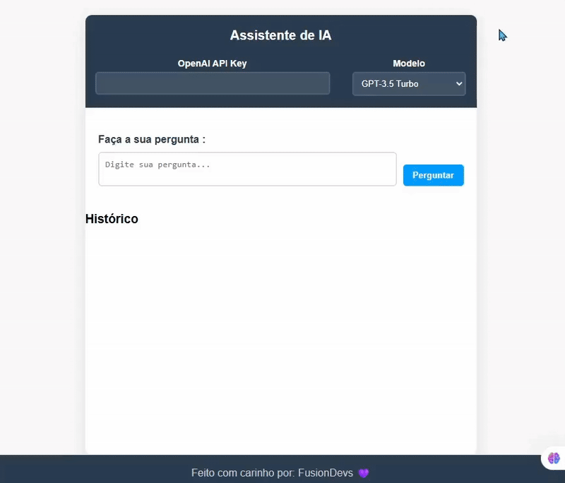

## 🤖 Assistente de IA com OpenAI

Um projeto simples de assistente virtual utilizando a API da OpenAI GPT-3.5 com interface web em HTML, CSS e JavaScript.

## 🖥️ Demonstração

Acesse o link: https://assistente-ai-nine.vercel.app/

## 🚀 Funcionalidades

- Integração com a API oficial da OpenAI
- Uso do modelo GPT-3.5
- Interface simples e responsiva
- Validação da API Key
- Exibição da resposta da IA no navegador

## 📁 Estrutura do Projeto

├── index.html 

├── style.css 

├── script.js 

└── README.md 

## 🧠 Tecnologias Utilizadas
- HTML5
- CSS3
- JavaScript (Vanilla)
- OpenAI API

## 💡 Autores
